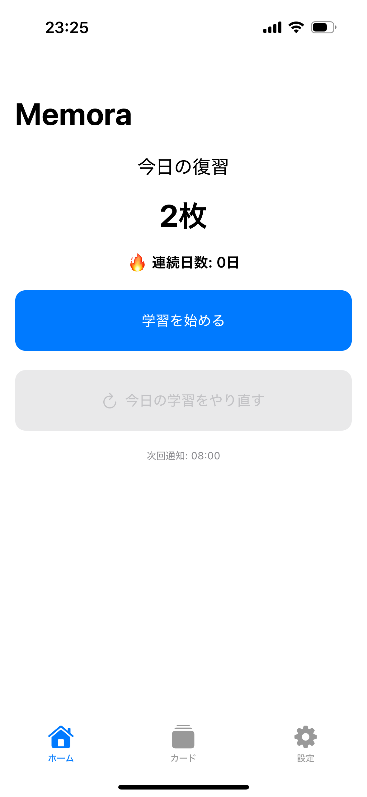
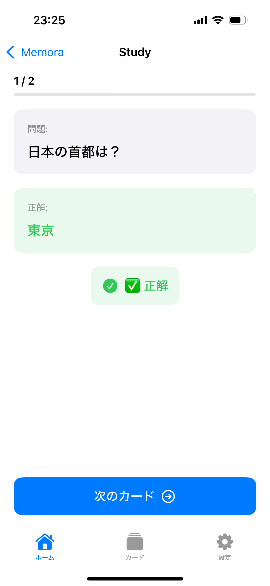
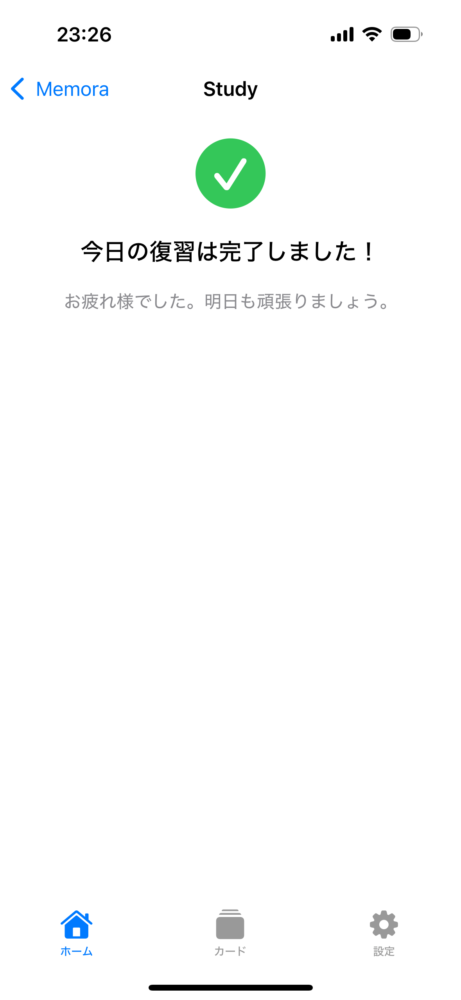
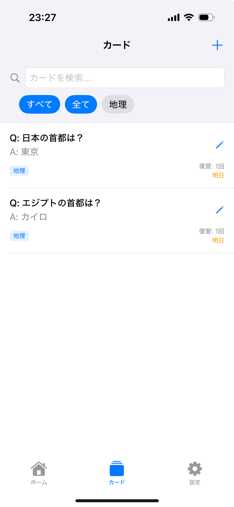
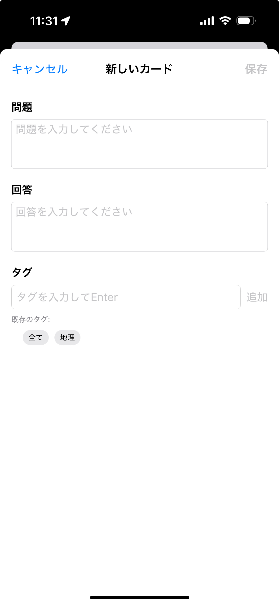
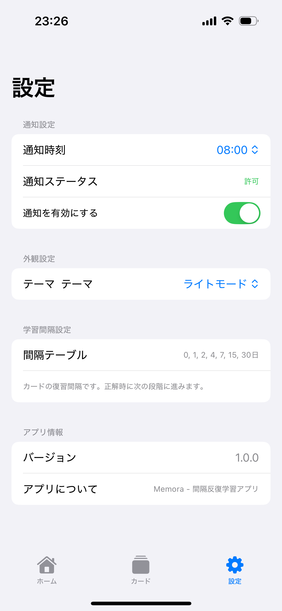

# Memora

暗記カード iOS アプリ。忘却曲線に基づいた反復学習が可能。（SwiftUI / ローカルJSON / ローカル通知あり）

## クイックスタート

### プロジェクトのセットアップ
```bash
git clone https://github.com/nshmura/memora.git
cd memora
```

### Bundle Identifier の変更
1. Xcode で `memora.xcodeproj` を開く
2. Target `memora` を選択
3. Signing & Capabilities タブを開く
4. Bundle Identifier を変更（例: `com.yourname.memora`）

### Development Team 設定
1. 同じく Signing & Capabilities
2. Team に自分の Apple ID (無料 or 有料 Developer) を選択
3. Automatically manage signing にチェック

### ビルドと実行
```bash
cd memora
xcodebuild clean build -target memora
```
もしくは Xcode で ⌘+R。

## 使い方（最低限の流れ）
1. Cards でカード追加
2. Homeから回答（正解→次間隔へ / 不正解→最初に戻る・翌日）
3. Home で今日の復習残数と連続日数を確認

## スクリーンショット

<table>
  <tr>
    <td align="center" width="33%"><strong>Home</strong><br/>
      
    </td>
    <td align="center" width="33%"><strong>学習（問題）</strong><br/>
      
    </td>
    <td align="center" width="33%"><strong>学習（回答後）</strong><br/>
      
    </td>
  </tr>
  <tr>
    <td align="center"><strong>Cards</strong><br/>
      
    </td>
    <td align="center"><strong>Settings</strong><br/>
      
    </td>
    <td align="center"><strong>Settings</strong><br/>
      
    </td>
  </tr>
</table>


## データ保存場所
ファイルアプリ: `このiPhone内/memora/data/`
- cards.json
- settings.json
- reviewLogs.json

## アーキテクチャ
MVVM + Repository 風シンプル分割:
```
Views (SwiftUI / ViewModel)
  ├─ Domain (Scheduler, NotificationPlanner)
  ├─ Models (Card, Settings, ReviewLog)
  └─ Store (JSON I/O)
```

## 開発メモ

- 仕様・タスク: `.kiro/specs/spaced-repetition-ios-app/`
- ガイド: `.github/copilot-instructions.md`
